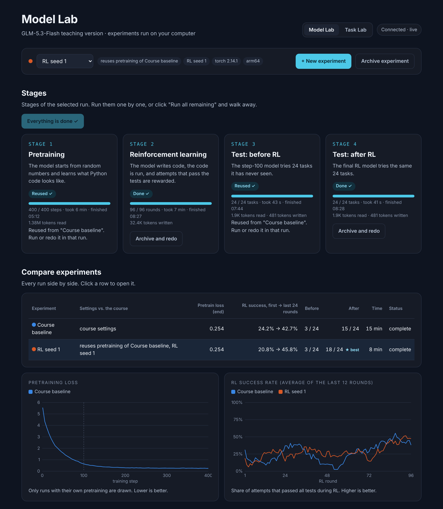
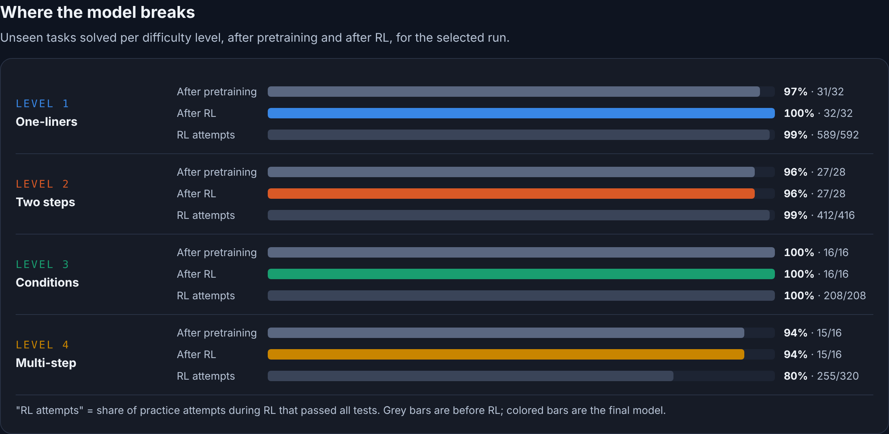

# Code Model Lab

[](https://github.com/ChadSaglam/code-model-lab/actions/workflows/tests.yml)

A local lab for code models. Train a small GLM-style model from random weights, test it on harder and harder Python tasks, and put it side by side with the models installed in Ollama, all on the same tasks and hidden tests, from one browser page on your own computer.



- **25.7M parameters**: hybrid linear/sparse attention, mixture of experts, four residual streams
- **Two training stages**: pretraining on Python code, then reinforcement learning rewarded by unit tests
- **Model Lab**: start runs with one click, watch them live, compare experiments side by side
- **Task Lab**: five difficulty levels of Python tasks (level 5 = tasks you write yourself), each checked by hidden tests
- **Try a task**: write your own solution, or ask the small model or a local Ollama model, and see every test case
- **Models**: test several Ollama models in a row on the same tasks, rank them in a leaderboard with tokens and speed, and make improved versions with their own instructions
- **Runs offline** on a Mac (Apple Silicon), on Linux with an NVIDIA GPU, or on a plain CPU

> Built on the open-source course *Build & Train GLM-5.3-Flash From Scratch* by Vuk Rosić (MIT License).
> The model and training code come from the course. The Model Lab, Task Lab, Models page, experiment tracking and tests in `lab/` and `tests/test_model_lab.py` were added in this project.
> Independent educational project; not affiliated with Z.ai.

---

## Contents

- [Results](#results)
- [Quick start](#quick-start)
- [Development](#development)
- [Using Model Lab](#using-model-lab)
- [Using Task Lab](#using-task-lab)
- [Using Models (Ollama)](#using-models-ollama)
- [How it works](#how-it-works)
- [Project structure](#project-structure)
- [Tests](#tests)
- [Limitations](#limitations)
- [Credits and license](#credits-and-license)

---

## Results

Measured on an Apple M4 MacBook Pro (PyTorch 2.14, Apple GPU). "Before" and "after" are the same 24 unseen tasks, one try each.

| Experiment | What changed | Solved before RL | Solved after RL | RL success, first → last 24 rounds |
|---|---|:---:|:---:|:---:|
| Course baseline | course settings | 3 / 24 | **15 / 24** | 24% → 43% |
| RL seed 1 | only the random seed of RL | 3 / 24 | **18 / 24** | 21% → 46% |

Changing nothing but the random seed moved the result by 3 tasks. Differences of that size between experiments are noise, not proof that a setting is better. Repeat a setting with several seeds before drawing conclusions.

Training time: pretraining 6 min 24 s (400 steps), reinforcement learning about 7 min (96 rounds).

**Task Lab, levels 1–4** (800 pretraining steps, 92 unseen tasks): 89 / 92 solved after pretraining, 90 / 92 after RL, in about 1 h 6 min. The scores are high because every task of a type shares the same correct answer; see [Limitations](#limitations).

---

## Quick start

You need **Python 3.10 or newer** (3.12 and 3.14 are tested) and about **1 GB** of free disk space.

**1. Get the code**

```bash
git clone <this-repository-url>
cd <repository-folder>
```

**2. Create an environment and install the packages** (1–3 minutes)

```bash
python3 -m venv .venv
.venv/bin/python -m pip install -r requirements.txt
```

**3. Check that everything works** (a few seconds)

```bash
.venv/bin/python -m pytest -q
```

You should see `37 passed`.

**4. Start the lab**

```bash
.venv/bin/python lab/serve_lab.py
```

Your browser opens **http://127.0.0.1:8765**. Keep the Terminal window open while you use the lab; press `Ctrl + C` there to stop it.

> On Windows, use `.venv\Scripts\python` instead of `.venv/bin/python`.

---

## Development

With `make` installed, three targets wrap the steps above:

```bash
make setup     # create .venv and install the pinned requirements
make check     # run the unit tests; stops on the first failure
make dev       # start the lab at http://127.0.0.1:8765
```

`make check` is the gate to run before staging a change. Contributor conventions — the branch
rule, commit style and what does not change without the owner — are in [AGENTS.md](AGENTS.md);
the to-do list is in [ROADMAP.md](ROADMAP.md).

---

## Using Model Lab

Model Lab (http://127.0.0.1:8765) runs the course's four stages and compares experiments.

| Stage | What happens | Time on an M4 Mac |
|---|---|---|
| 1 · Pretraining | The model starts from random numbers and learns what Python looks like | ~6 min |
| 2 · Reinforcement learning | The model writes code, the code is run, passing attempts are rewarded | ~7 min |
| 3 · Test before RL | The step-100 model tries 24 tasks it has never seen | < 1 min |
| 4 · Test after RL | The final model tries the same 24 tasks | < 1 min |

**First run:** select *Course baseline* and click **Run all remaining ▶▶**. The stages run one after another; each card shows progress, time left, and afterwards how long it took.

**New experiment:** click **+ New experiment**, give it a name, change one or two settings, and click **Create and run all**.

| Setting | Course value | What it changes |
|---|---|---|
| RL learning rate | 0.00005 | How big each RL update is |
| RL sampling temperature | 0.35 | Lower = safer, more similar attempts |
| Attempts per task | 16 | More attempts = more chances to succeed, but slower |
| RL seed / pretraining seed | 31415 / 42 | Which random numbers are used |
| Pretraining learning rate | 0.0003 | How fast pretraining learns |

*Reuse pretraining* skips stage 1 and only re-runs RL: the fastest way to test RL ideas.

**Compare:** the comparison table and the overlaid curves show every experiment at once. Click a row to open it. *Development journey* lets saved snapshots of one experiment (random start → final model) answer the same task side by side.

---

## Using Task Lab

Task Lab (http://127.0.0.1:8765/tasks) asks a different question: **how far can a model this small go?**

| Level | Tasks | Example |
|---|---|---|
| 1 · One-liners | The 8 course task types | `return x + 1` |
| 2 · Two steps | Two inputs or two operations | `return max(a, b, c)` |
| 3 · Conditions | `if` statements over several lines | sign of a number, clamp to a range |
| 4 · Multi-step | 3–7 line functions with variables | average, FizzBuzz, range of a list |
| 5 · Your tasks | Tasks you add on the page | anything that follows the rules below |

Click **+ New run**, pick the levels and the number of pretraining steps, then **Create and run all**. The context and answer length grow automatically to fit the hardest level. *Where the model breaks* shows, per level, how many unseen tasks were solved after pretraining and after RL.

A run with all four levels and 800 pretraining steps takes roughly an hour on an M4 Mac.



**Add your own task (level 5):** on the level 5 card click **+ Add your task**, write a one-sentence description, the function as it should be solved, and a few tests, one per line:

```python
def with_vat(price):
    return price * 108 // 100
```

```text
100 -> 108
50 -> 54
0 -> 0
```

The lab checks right away that your function passes its own tests, then the task can be trained on, tested and tried like any other. Rules (shared by every task, so scores stay comparable): one function whose last line is `return ...`; no loops, imports or method calls; only `sum`, `len`, `abs`, `min`, `max`, `bool`, `int` and `str`.

**Try a task yourself:** pick any task, write a solution and click **Run tests**: you see each input, the expected value and what your function returned. **Ask** sends the same task to a local model or to a saved snapshot of the small model.

**Tokens:** every finished stage shows how many tokens it read and wrote. The small model uses one token per byte; pretraining reads its training text, RL and the tests write answers.

---

## Using Models (Ollama)

The **Models** tab (http://127.0.0.1:8765/models) works with the models installed in [Ollama](https://ollama.com) on your computer.

**Test:** tick one or more models, pick a test set (the 24 course tasks, or Task Lab levels) and click **Test selected ▶**. The models run one after another; each answers the same unseen tasks and the same hidden tests check every answer.

**Compare:** the leaderboard ranks every finished test by score and shows tokens read and written, time and speed, with the small model trained in this lab as a reference row. Click a row to see the answers that failed and why.

**Improve:** *Improve a model* makes a new Ollama model from an installed one with its own instructions (a system prompt), for example the lab's rules about loops and method calls. Click **Create and test against the original ▶** to see whether the instructions help. Ollama reuses the original's weights, so this takes seconds and almost no disk space. It changes how the model is told to answer, not what it knows. Models made here are marked *made here* and can be deleted from the page; models you installed yourself are never deleted by the lab.

Answers are deterministic (temperature 0, thinking off). Everything runs on your computer; nothing is sent anywhere and nothing costs money. Set `OLLAMA_HOST` if Ollama runs on a different address.

---

## How it works

```text
Browser ──► lab/serve_lab.py (local server, 127.0.0.1 only)
                 │ starts one stage at a time as a separate process
                 ▼
         scripts/train_pretrain.py · scripts/train_rl.py · scripts/evaluate.py
                 │ (Task Lab goes through lab/ladder.py to add the harder levels)
                 ▼
         runs/  checkpoints, receipts and test reports, read back by the page
```

The course code is never modified; the lab only runs it and reads its output. Design decisions and their trade-offs are documented in [docs/architecture.md](docs/architecture.md) and the [architecture decision records](docs/adr/).

**The model** (from the course): raw UTF-8 bytes as tokens (260 tokens), 12 layers in a *3 linear : 1 sparse* attention rhythm, 8 routed experts (2 active) plus a shared expert, and four residual streams. Reinforcement learning uses RLOO: 16 attempts per task, each compared with the average of the other 15. Only the last block and the output head (2.19M parameters) are updated during RL.

---

## Project structure

```text
├── lab/                    Model Lab, Task Lab and Models
│   ├── serve_lab.py        local server: runs stages, tracks experiments, serves the page
│   ├── index.html          the page (Model Lab at /, Task Lab at /tasks, Models at /models)
│   ├── ladder.py           Task Lab difficulty levels and their hidden tests
│   ├── local_models.py     Ollama client (test, create, delete), answer extraction, safe test runs
│   ├── ollama_eval.py      runs a test set against a local model
│   ├── try_task.py         one task: your code, a local model or a snapshot
│   ├── custom_tasks.json   your level-5 tasks (created when you add one)
│   └── README.md           lab details
├── glm53_flash/            the model, tokenizer, tasks and code verifier (course)
├── scripts/                pretraining, RL and evaluation scripts (course)
├── experiments/            the course's research experiments
├── tests/                  course tests + lab tests
├── artifacts/              the course author's published results and charts
├── docs/
│   ├── architecture.md     how the lab is built
│   ├── adr/                architecture decision records
│   ├── images/             screenshots
│   └── course/             the original course README, report and tutorial
├── runs/                   your training results (not committed)
└── requirements.txt
```

---

## Tests

```bash
.venv/bin/python -m pytest -q
```

| Test file | Checks |
|---|---|
| `tests/test_lab.py` | tokenizer round trip, causal attention, 3 : 1 layer rhythm, expert usage, reference solutions (course) |
| `tests/test_vision.py`, `tests/test_full_25m_vision_digit_pilot.py` | the course's optional image path |
| `tests/test_model_lab.py` | Task Lab levels, level-5 validation, answer extraction, local-model runs, model queues and instruction variants (with a stand-in Ollama), settings validation and the server's safety rules |

---

## Limitations

- **A teaching model.** 25.7M parameters, a 192–320 character context and minutes of training. It learns narrow task patterns, not general programming.
- **Fixed answers per task type.** Every task of a type shares the same correct solution; only the function name and wording change. High scores show the model maps a description to the right pattern, not that it solves new problems. Tasks with varying constants and held-out task types are planned (see [ADR-004](docs/adr/0004-task-levels-injected-at-runtime.md)).
- **Small test sets.** 24 tasks (Model Lab) or 4 per task type (Task Lab). Differences of a few tasks are within seed noise.
- **Same rules for every model.** Large local models sometimes answer with loops or method calls, which the tests reject by design; the result shows the reason.
- **Single user, local only.** The lab is built for one person on one computer; see [ADR-005](docs/adr/0005-local-control-server-security.md) for its security model.

---

## Credits and license

- Model, training code, course material and original results: **Vuk Rosić**, *Build & Train GLM-5.3-Flash From Scratch* (MIT License). The original README, report and tutorial are kept in [docs/course/](docs/course/).
- Model Lab, Task Lab, Models, experiment tracking, lab tests and documentation: added in this project.
- Inspired by the architecture of GLM-5.3-Flash by Z.ai; this is an independent, scaled-down educational implementation.

Released under the [MIT License](LICENSE).
